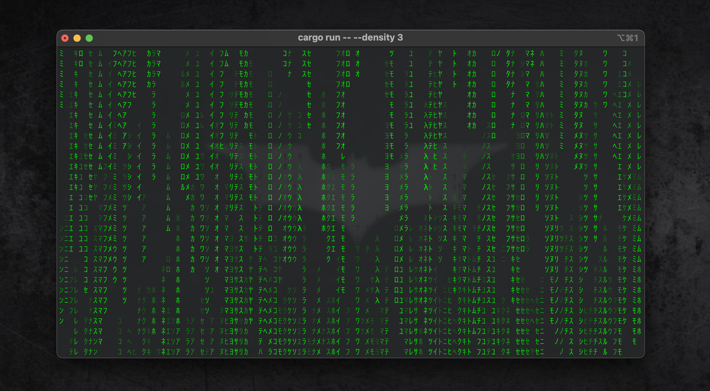

# Rustrix / Matrix Animation 💻

A highly performant and customizable terminal animation that simulates the iconic "digital rain" effect from The Matrix. Built in Rust, this application leverages the `crossterm` and `tokio` libraries to create a smooth, responsive, and resource-efficient visual experience that reacts in real-time to terminal resizing and user input.
This code is based on Matrix Animation golang version, see [HuGoRain](https://github.com/hugomf/hugo_rain.git) 



## ✨ Features

-   **Asynchronous:** Built on the `tokio` runtime, ensuring a non-blocking and highly responsive animation loop.
-   **Fully Customizable:** Easily change the color theme, character set, speed, and density using command-line arguments.
-   **Real-time Responsiveness:** The animation dynamically adjusts to terminal resizing without a hitch.
-   **Automatic Background Detection:** The program can automatically detect your terminal's background color to create seamless, fading drop trails.
-   **Multiple Character Sets:** Choose from predefined sets like binary, emojis, or Kanji, or provide your own.

## ⚙️ How to Run

### Prerequisites

-   [Rust and Cargo](https://www.rust-lang.org/tools/install) installed on your system.

### Running from source

1.  **Clone the repository:**
    ```bash
    git clone [https://github.com/hugomf/rustrix.git](https://github.com/hugomf/rustrix.gi)
    cd rustrix
    ```

2.  **Run the application:**
    ```bash
    cargo run --release
    ```
    _Note: Using `--release` is highly recommended for optimal performance._

### Command-line Flags

You can customize the animation using the following flags. Use `--list` to see all available options.

-   `--color <NAME>`
    -   Sets the color theme.
    -   **Available Colors:** `green` (default), `amber`, `red`, `orange`, `blue`, `purple`, `cyan`, `pink`, `white`.
    -   **Example:** `cargo run -- --color blue`

-   `--chars <NAME>`
    -   Specifies the character set to use.
    -   **Available Sets:** `matrix` (default), `binary`, `symbols`, `emojis`, `kanji`, `greek`, `cyrillic`.
    -   **Example:** `cargo run -- --chars emojis`

-   `--speed <VALUE>`
    -   Controls the animation speed. Higher values mean faster animation.
    -   **Default:** `5.0`.
    -   **Example:** `cargo run -- --speed 20.0` (insanely fast)

-   `--density <VALUE>`
    -   Adjusts the number of drops on the screen. Higher values result in more drops.
    -   **Default:** `0.7`.
    -   **Example:** `cargo run -- --density 1.5` (heavy density)

-   `--background-color <R,G,B>`
    -   Manually sets the background color for accurate color fading. By default, it will attempt to detect the terminal's background color.
    -   **Example:** `cargo run -- --background-color 0,0,0` (black)

-   `--list`
    -   Displays all available options and their values.
    -   **Example:** `cargo run -- --list`

### Example Usage

```bash
# Run with a fast, purple-colored binary drop
cargo run --release -- --color purple --chars binary --speed 10.0

# Run with a heavy density of Kanji characters
cargo run --release -- --chars kanji --density 1.2
